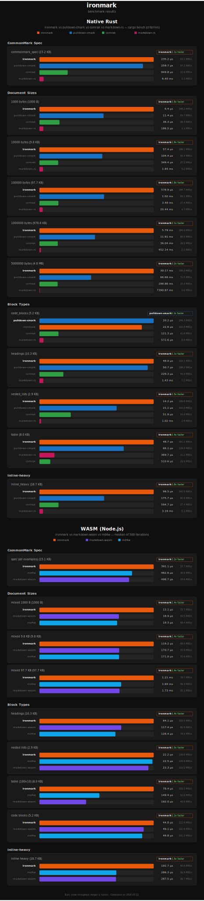

# ironmark

[](https://github.com/ph1p/ironmark/actions/workflows/ci.yml) [](https://www.npmjs.com/package/ironmark) [](https://crates.io/crates/ironmark)

Fast Markdown to HTML/AST parser written in Rust with **zero third-party** parsing dependencies. Fully compliant with [CommonMark 0.31.2](https://spec.commonmark.org/0.31.2/) (652/652 spec tests pass). Available as a Rust crate and as an npm package via WebAssembly, with both HTML and AST output APIs.

## Options

All options default to `true`.

| Option        | JS (`camelCase`)      | Rust (`snake_case`)    | Description                    |
| ------------- | --------------------- | ---------------------- | ------------------------------ |
| Hard breaks   | `hardBreaks`          | `hard_breaks`          | Every newline becomes `<br />` |
| Highlight     | `enableHighlight`     | `enable_highlight`     | `==text==` → `<mark>`          |
| Strikethrough | `enableStrikethrough` | `enable_strikethrough` | `~~text~~` → `<del>`           |
| Underline     | `enableUnderline`     | `enable_underline`     | `++text++` → `<u>`             |
| Tables        | `enableTables`        | `enable_tables`        | Pipe table syntax              |
| Autolink      | `enableAutolink`      | `enable_autolink`      | Bare URLs & emails → `<a>`     |
| Task lists    | `enableTaskLists`     | `enable_task_lists`    | `- [ ]` / `- [x]` checkboxes   |

## JavaScript / TypeScript

```bash
npm install ironmark
# or
pnpm add ironmark
```

### Node.js

WASM is embedded and loaded synchronously — no `init()` needed:

```ts
import { parse } from "ironmark";

const html = parse("# Hello\n\nThis is **fast**.");
```

### AST Output

Use `parseToAst()` when you need the block-level document structure instead of rendered HTML.

```ts
import { parseToAst } from "ironmark";

const astJson = parseToAst("# Hello\n\n- [x] done");
const ast = JSON.parse(astJson);
```

`parseToAst()` returns a JSON string for portability across JS runtimes and WASM boundaries.

### Browser / Bundler

Call `init()` once before using `parse()`. It's idempotent and optionally accepts a custom `.wasm` URL.

```ts
import { init, parse } from "ironmark";

await init();

const html = parse("# Hello\n\nThis is **fast**.");
```

#### Vite

```ts
import { init, parse } from "ironmark";
import wasmUrl from "ironmark/ironmark.wasm?url";

await init(wasmUrl);

const html = parse("# Hello\n\nThis is **fast**.");
```

## Rust

```bash
cargo add ironmark
```

```rust
use ironmark::{parse, ParseOptions};

fn main() {
    // with defaults
    let html = parse("# Hello\n\nThis is **fast**.", &ParseOptions::default());

    // with custom options
    let html = parse("line one\nline two", &ParseOptions {
        hard_breaks: false,
        enable_strikethrough: false,
        ..Default::default()
    });
}
```

### AST Output

`parse_to_ast()` returns the typed Rust AST (`Block`) directly:

```rust
use ironmark::{Block, ParseOptions, parse_to_ast};

fn main() {
    let ast = parse_to_ast("# Hello", &ParseOptions::default());

    match ast {
        Block::Document { children } => {
            println!("top-level blocks: {}", children.len());
        }
        _ => unreachable!("root node is always Document"),
    }
}
```

Exported AST types:

- `Block`
- `ListKind`
- `TableData`
- `TableAlignment`

## Benchmarks



## Development

This project uses [pnpm](https://pnpm.io/) for package management.

### Build from source

```bash
pnpm setup:wasm
pnpm build
```

| Command           | Description            |
| ----------------- | ---------------------- |
| `pnpm setup:wasm` | Install prerequisites  |
| `pnpm build`      | Release WASM build     |
| `pnpm build:dev`  | Debug WASM build       |
| `pnpm test`       | Run Rust tests         |
| `pnpm check`      | Format check           |
| `pnpm clean`      | Remove build artifacts |

### Troubleshooting

**`wasm32-unknown-unknown target not found`** or **`wasm-bindgen not found`** — run `pnpm setup:wasm` to install all prerequisites.
